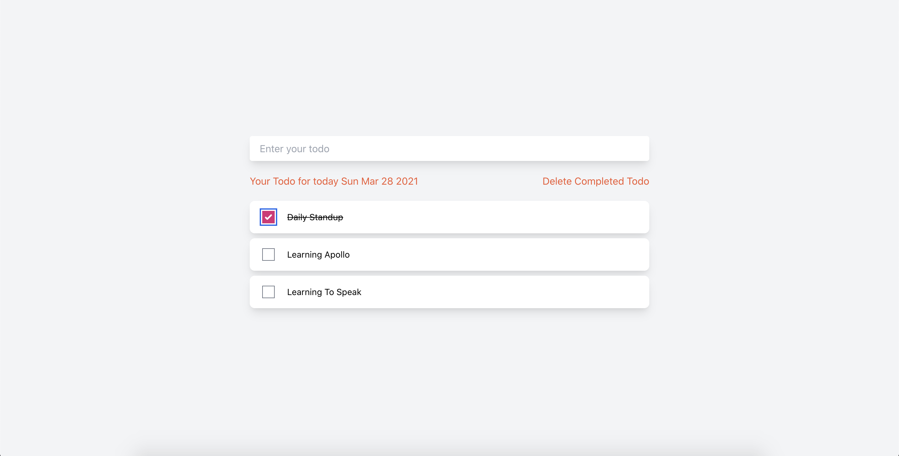

# Personal Todos Client Apps

Hi! It's my project **personal-todos-system** for client. If you want to check ont the backend code, go to my another repo by clicking [here](https://github.com/beebeewijaya-tech/todos-server)



## How to run this project

```bash
cd project
yarn install or npm install

yarn start or npm start
```

that's how you need to run this, remember to clone the backend project too